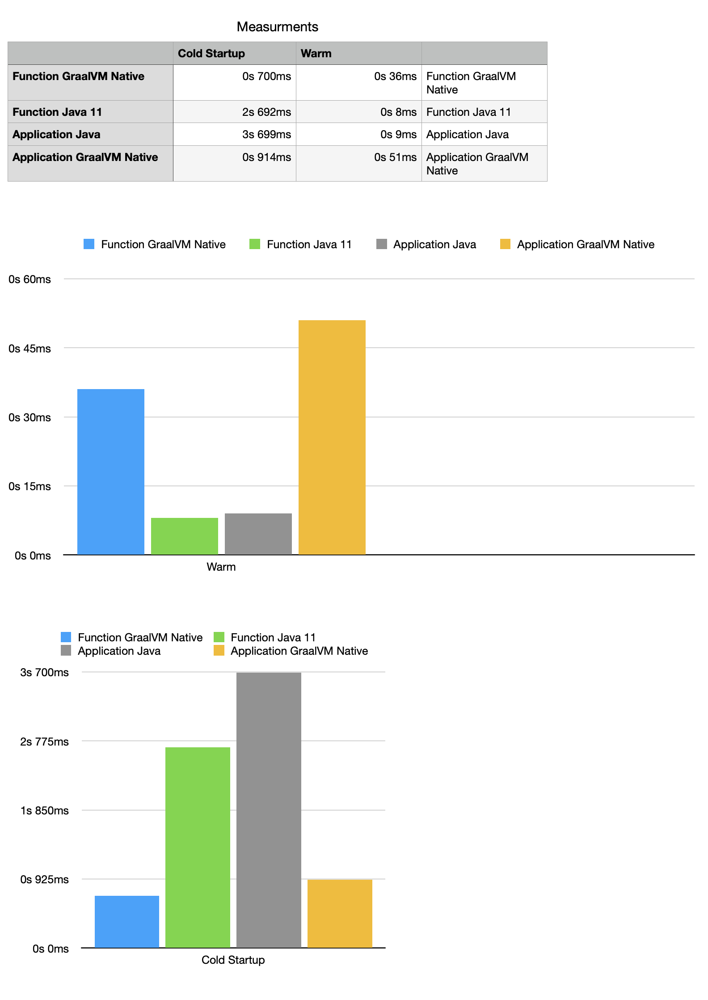

## Scenarios

| Done | Application Type |Runtime | AOT | Command  | 
|:-----| :---        |:---      |:---    | :--- |
| [ ]  | Application | Java 11 | FALSE  | `export TEST_SUITE=GRADLE_APP;./release.sh`  |
| [ ]  | Application | Java 11 | TRUE  | `export TEST_SUITE=GRADLE_APP_AOT;./release.sh`  |
| [ ]  | Application | NATIVE | FALSE  | `export TEST_SUITE=GRADLE_APP_NATIVE;./release.sh`  |
| [ ]  | Application | NATIVE | TRUE  | `export TEST_SUITE=GRADLE_APP_NATIVE_AOT;./release.sh`  |
| [ ]  | Function | Java 11 | FALSE  | `export TEST_SUITE=GRADLE_FUNCTION;./release.sh`  |
| [ ]  | Function | Java 11 | TRUE  | `export TEST_SUITE=GRADLE_FUNCTION_AOT;./release.sh`  |
| [ ]  | Function | NATIVE | FALSE  | `export TEST_SUITE=GRADLE_FUNCTION_NATIVE;./release.sh`  |
| [ ]  | Function | NATIVE | TRUE  | `export TEST_SUITE=GRADLE_FUNCTION_NATIVE_AOT;./release.sh`  |
