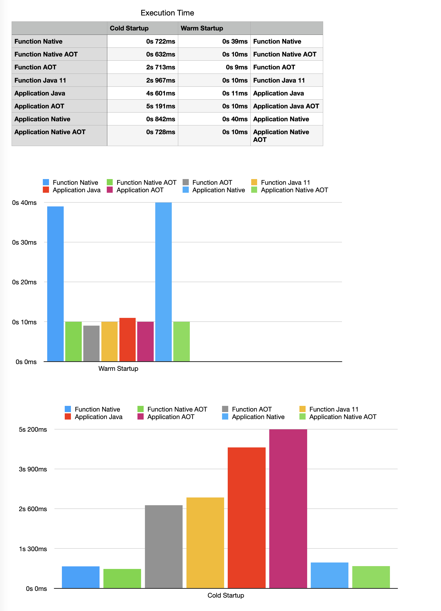

## Scenarios

### Application

- [ ] Application Type: `Micronaut Application` with `Java 11 Runtime`. `export TEST_SUITE=GRADLE_APP;./release.sh`
- [ ] AOT Optimized. Application Type: `Micronaut Application` with `Java 11 Runtime`. `export TEST_SUITE=GRADLE_APP_AOT;./release.sh`
- [ ] Native. Application Type: `Micronaut Application` with `Provided` runtime. GraalVM Native Image.. `export TEST_SUITE=GRADLE_APP_NATIVE;./release.sh`
- [ ] AOT Optimized. Native. Application Type: `Micronaut Application` with `Provided` runtime. GraalVM Native Image.. `export TEST_SUITE=GRADLE_APP_NATIVE_AOT;./release.sh`

### Function

- [ ] Application Type: `Function Application for Serverless` with `Java 11 Runtime`. `export TEST_SUITE=GRADLE_FUNCTION;./release.sh`
- [ ] AOT Optimized. Application Type: `Function Application for Serverless` with `Java 11 Runtime`. `export TEST_SUITE=GRADLE_FUNCTION_AOT;./release.sh`
- [ ] Native. Application Type: `Function Application for Serverless` with `Provided` runtime. GraalVM Native Image.. `export TEST_SUITE=GRADLE_FUNCTION_NATIVE;./release.sh`
- [ ] AOT Optimized. Native. Application Type: `Function Application for Serverless` with `Provided` runtime. GraalVM Native Image.. `export TEST_SUITE=GRADLE_FUNCTION_NATIVE_AOT;./release.sh`
